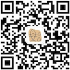

# 探知刊物

探知刊物，是以探索世界为主题的刊物，通过及时整理最新的各类素材，来辅助 Web 或随笔等主题的写作，一切的目的在于启发、欣赏与提升。

探知刊物会每天自动进行更新，推荐依据是访客们的推荐值。刊物内容源自一些知名网站的开放数据（见<a href="https://www.yulisay.com/weekly/news">探知推荐</a>），当然也欢迎大家补充更丰富的资讯。

欢迎大家的支持、传播和投稿。若需要投稿，请提交 issue ；若觉得有用，请分享并 star 。

# 关注

本刊物将在 [魚立说个人网站](https://www.yulisay.com/) 、微信公众号（**于立为文**）与 [GitHub](https://github.com/yulis-say/weekly) 保持同步更新，欢迎你的长期关注。请关注我的微信公众号：

# 支持

非常感谢您对本刊的支持，扫码打赏，您说多少就多少：

# 刊物目录

<!---->

- [探知刊物-每周分享第 19 期（20210503）](20210503.md)

- [探知刊物-每周分享第 18 期（20210419）](20210419.md)

- [探知刊物-每周分享第 17 期（20210412）](20210412.md)

- [探知刊物-每周分享第 16 期（20210405）](20210405.md)

- [探知刊物-每周分享第 15 期（20210329）](20210329.md)

- [探知刊物-每周分享第 14 期（20210322）](20210322.md)

- [探知刊物-每周分享第 13 期（20210315）](20210315.md)

- [探知刊物-每周分享第 12 期（20210308）](20210308.md)

- [探知刊物-每周分享第 11 期（20210301）](20210301.md)

- [探知刊物-每周分享第 10 期（20210222）](20210222.md)

- [探知刊物-每周分享第 9 期（20210208）](20210208.md)

- [探知刊物-每周分享第 8 期（20210201）](20210201.md)

- [探知刊物-每周分享第 7 期（20210125）](20210125.md)

- [探知刊物-每周分享第 6 期（20210118）](20210118.md)

- [探知刊物-每周分享第 5 期（20210111）](20210111.md)

- [探知刊物-每周分享第 4 期（20210104）](20210104.md)

- [探知刊物-每周分享第 3 期（20201228）](20201228.md)

- [探知刊物-每周分享第 2 期（20201221）](20201221.md)

- [探知刊物-每周分享第 1 期（20201214）](20201214.md)

